# SpringBoot项目练手


# Day1

## 1、软件开发整体介绍

### 软件开发流程

- 需求分析
  - 确定产品原型，制定需求规格说明书
- 设计
  - 建立产品文档，UI界面设计、概要设计、详细设计、数据库设计
- 编码
  - 项目代码、单元测试
- 测试
  - 测试用例、测试报告
- 上线运维
  - 软件环境安装、配置


### 软件环境


## 2、项目介绍

本项目分为系统管理后台+移动端应用两部分

- 系统管理后台：主要供内部人员使用，可对餐厅的菜品、套餐、订单等进行管理维护
- 移动端应用：供消费者使用，可在线浏览菜品、添加购物车、下单等

开发周期：

1. 实现基本需求，移动端应用通过H5实现，用户可通过手机浏览器访问
2. 针对移动端应用改进，使用微信小程序实现
3. 对系统优化升级，提高系统的访问性能


### 产品原型

- 非成品，仅用于展示功能；为产品成型之前的一个框架，展示页面的排版布局，从而了解项目的需求和提供的功能
- 分用户端和管理端


### 技术选型

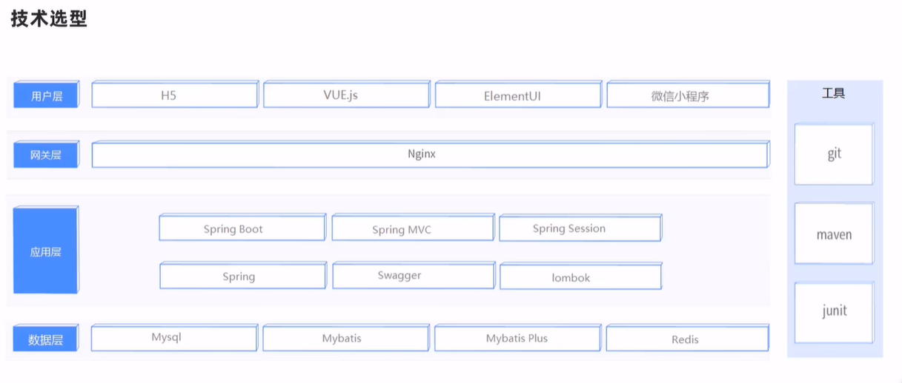

### 功能架构

- 移动端前台（H5、微信小程序实现）
  - 手机号、微信登录
  - 地址管理
  - 历史订单
  - 菜品规格
  - 购物车
  - 下单
  - 菜品浏览
- 系统管理后台
  - 分类管理
  - 菜品管理
  - 套餐管理
  - 菜品口味管理
  - 员工登录、退出
  - 员工管理
  - 订单管理

角色：

- 后台管理员：登录后台管理系统、拥有后台系统所有操作权限
- 后台普通员工：登录后台
- 客户端用户：登录移动端应用，可浏览菜品、添加购物车、设置地址、在线下单等


## 3、环境搭建

### 数据库环境创建

在数据库中创建需要用到的各个表，表格如下：

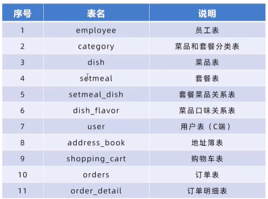

- 先在sqlyog中创建数据库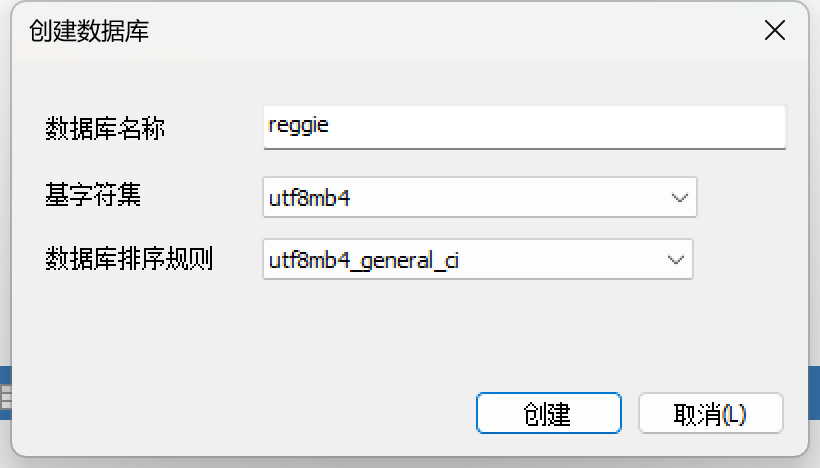确定好基字符集和数据库排序规则

- 在SQLyog中执行中的db_reggie.sql

  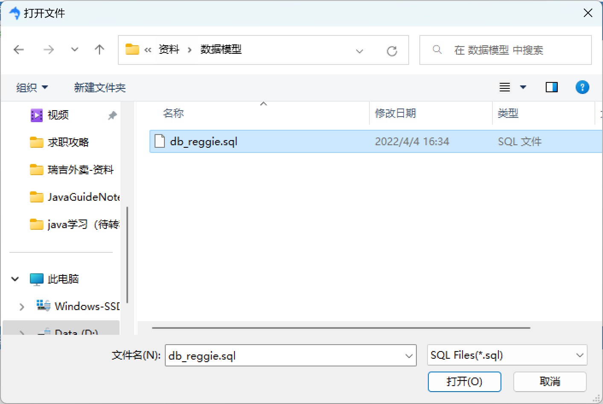

- 可得到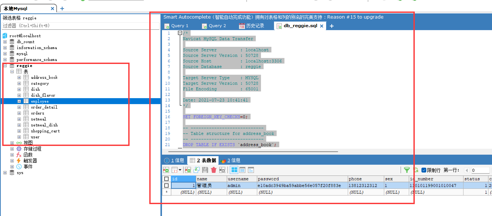

  

### maven项目搭建

- 创建好maven项目后，在pom.xml中添加依赖（后续也可以直接选择springinitializer创建）

  - 配置内容：

    - 设置springboot的starter父类
    - 设置Java版本
    - 依赖项：boot的starter，test；web的starter，mybatis-plus,lombok,commons-lang,mysql-connector-java,fastjson,druid
    - plugins

  - ```xml
    <?xml version="1.0" encoding="UTF-8"?>
    <project xmlns="http://maven.apache.org/POM/4.0.0"
             xmlns:xsi="http://www.w3.org/2001/XMLSchema-instance"
             xsi:schemaLocation="http://maven.apache.org/POM/4.0.0 http://maven.apache.org/xsd/maven-4.0.0.xsd">
        <modelVersion>4.0.0</modelVersion>
        <parent>
            <groupId>org.springframework.boot</groupId>
            <artifactId>spring-boot-starter-parent</artifactId>
            <version>2.4.5</version>
            <relativePath/> <!-- lookup parent from repository -->
        </parent>
        <groupId>com.bupt</groupId>
        <artifactId>SpringBoot_TakeOut</artifactId>
        <version>1.0-SNAPSHOT</version>
    
        <properties>
            <maven.compiler.source>11</maven.compiler.source>
            <maven.compiler.target>11</maven.compiler.target>
            <java.version>11</java.version>
        </properties>
    
        <dependencies>
    
            <dependency>
                <groupId>org.springframework.boot</groupId>
                <artifactId>spring-boot-starter</artifactId>
            </dependency>
    
            <dependency>
                <groupId>org.springframework.boot</groupId>
                <artifactId>spring-boot-starter-test</artifactId>
                <scope>test</scope>
            </dependency>
    
            <dependency>
                <groupId>org.springframework.boot</groupId>
                <artifactId>spring-boot-starter-web</artifactId>
                <scope>compile</scope>
            </dependency>
    
            <dependency>
                <groupId>com.baomidou</groupId>
                <artifactId>mybatis-plus-boot-starter</artifactId>
                <version>3.4.2</version>
            </dependency>
    
            <dependency>
                <groupId>org.projectlombok</groupId>
                <artifactId>lombok</artifactId>
                <version>1.18.20</version>
            </dependency>
    
            <dependency>
                <groupId>com.alibaba</groupId>
                <artifactId>fastjson</artifactId>
                <version>1.2.76</version>
            </dependency>
    
            <dependency>
                <groupId>commons-lang</groupId>
                <artifactId>commons-lang</artifactId>
                <version>2.6</version>
            </dependency>
    
            <dependency>
                <groupId>mysql</groupId>
                <artifactId>mysql-connector-java</artifactId>
                <scope>runtime</scope>
            </dependency>
    
            <dependency>
                <groupId>com.alibaba</groupId>
                <artifactId>druid-spring-boot-starter</artifactId>
                <version>1.1.23</version>
            </dependency>
    
        </dependencies>
    
        <build>
            <plugins>
                <plugin>
                    <groupId>org.springframework.boot</groupId>
                    <artifactId>spring-boot-maven-plugin</artifactId>
                    <version>2.4.5</version>
                </plugin>
            </plugins>
        </build>
    </project>
    ```

- 在resources中创建.yml（相当于properties，会改即可，不用自行写）

  - 在资料中找到用其中的application.yml，结合需要修改配置即可

  - ```yml
    server:
      port: 8080
    spring:
      application:
        name: reggie_take_out
      datasource:
        druid:
          driver-class-name: com.mysql.cj.jdbc.Driver
          url: jdbc:mysql://localhost:3306/reggie?serverTimezone=Asia/Shanghai&useUnicode=true&characterEncoding=utf-8&zeroDateTimeBehavior=convertToNull&useSSL=false&allowPublicKeyRetrieval=true
          username: root
          password: yys674291192
    mybatis-plus:
      configuration:
        #在映射实体或者属性时，将数据库中表名和字段名中的下划线去掉，按照驼峰命名法映射
        map-underscore-to-camel-case: true
        log-impl: org.apache.ibatis.logging.stdout.StdOutImpl
      global-config:
        db-config:
          id-type: ASSIGN_ID
    ```

- 配置完成后编写启动类，创建com.bupt.TakeOut.

  - ```java
    package com.bupt.TakeOut;
    
    import lombok.extern.slf4j.Slf4j;
    import org.springframework.boot.SpringApplication;
    import org.springframework.boot.autoconfigure.SpringBootApplication;
    
    @Slf4j//记录日志
    @SpringBootApplication//作为boot启动类
    public class mainAppliaction {
        public static void main(String[] args) {
            SpringApplication.run(mainAppliaction.class, args);
            log.info("启动成功...");//打印日志
        }
    }
    
    ```

  - 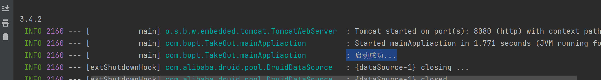


### 搬运前端的静态资源

- 将两个资源放入resources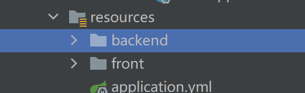


- 默认情况下，无法直接访问resources下的资源
  - 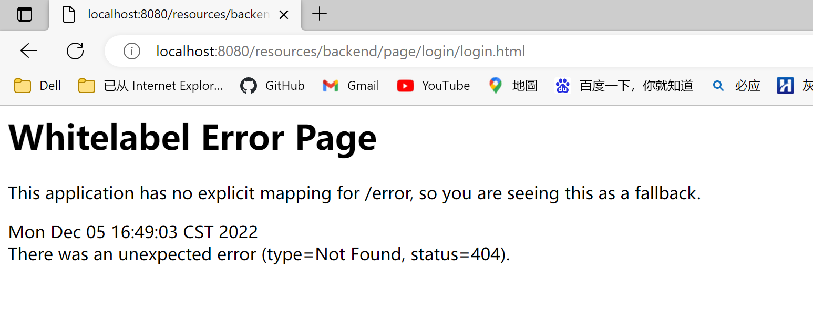
- 上面可以看出，404，未找到，需要进行静态资源的映射
- 在TakeOut下建立config.WebMvcConfig进行映射
  - 启用日志并声明configuration组件
  
  - ```Java
    @Slf4j//启用日志
    @Configuration//标注为configuration组件
    public class WebMvcConfig extends WebMvcConfigurationSupport {
    
        //ctrl+O,重写父类方法
        //对增加资源处理器进行重写
        @Override
        protected void addResourceHandlers(ResourceHandlerRegistry registry) {
            log.info("开始静态资源的映射");
            //设置路径，由此即可在backend下的目录进行检索
            registry.addResourceHandler("/backend/**").addResourceLocations("classpath:/backend/");
            //front同理
            registry.addResourceHandler("/front/**").addResourceLocations("classpath:/front/");
        }
    }
    ```
  
  - 访问localhost:8080//backend/page/login/login.html)

## 4、后台登录功能开发

### 需求分析

- 由下图可知，点击登录，请求的url为localhost:8080/employee/login，但是状态为404，说明后台系统没有响应该请求的处理，因此需要创建相应的类处理该请求

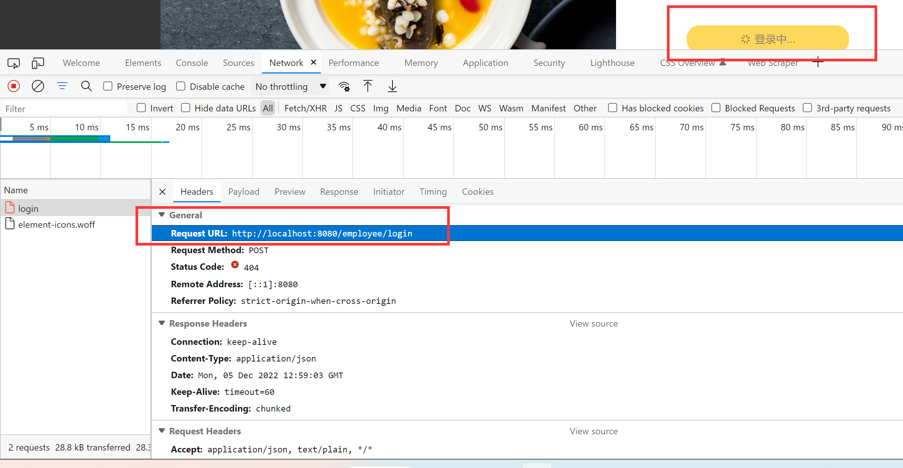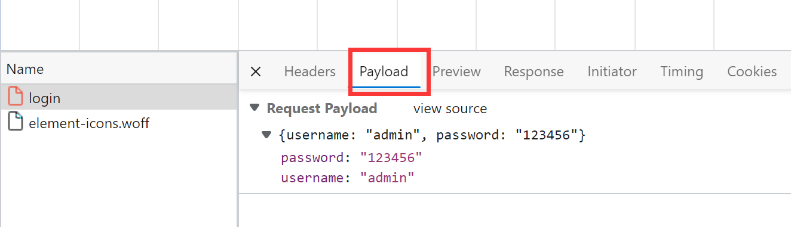

- 数据库中employee表单

  - 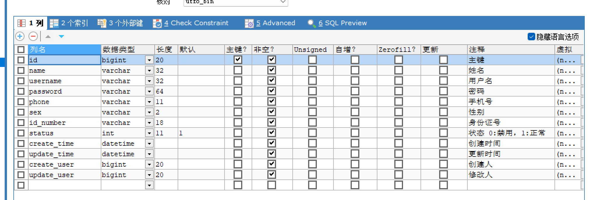

- 需要创建employee实体类和数据库employee表单进行映射（已经开启驼峰式名称转换，数据库中的下划线格式可转为Java中的驼峰式

  - 建立entity.employee实体类

  - ```Java
    @Data
    public class Employee implements Serializable {
    
        private static final long serialVersionUID = 1L;
    
        private Long id;
    
        private String username;
    
        private String name;
    
        private String password;
    
        private String phone;
    
        private String sex;
    
        private String idNumber;
    
        private Integer status;
    
        private LocalDateTime createTime;
    
        private LocalDateTime updateTime;
    
        @TableField(fill = FieldFill.INSERT)
        private Long createUser;
    
        @TableField(fill = FieldFill.INSERT_UPDATE)
        private Long updateUser;
    
    }
    
    ```

- 建立控制、服务、映射各个层Controller、Service、Mapper

- ```Java
  package com.bupt.TakeOut.mapper;
  
  import com.baomidou.mybatisplus.core.mapper.BaseMapper;
  import com.bupt.TakeOut.entity.Employee;
  import org.apache.ibatis.annotations.Mapper;
  
  @Mapper
  //继承mybatisPlus中的BaseMapper(封装了操作sql的各种方法
  public interface EmployeeMapper extends BaseMapper<Employee> {
  }
  ————————————————————————————————————————————————————————
  package com.bupt.TakeOut.service;
  
  import com.baomidou.mybatisplus.extension.service.IService;
  import com.bupt.TakeOut.entity.Employee;
  
  //与Mapper同理，继承mybatisPlus
  public interface EmployeeService extends IService<Employee> {
  }
  ——————————————————————————————————————————————————————————
  package com.bupt.TakeOut.service.impl;
  
  import com.baomidou.mybatisplus.extension.service.impl.ServiceImpl;
  import com.bupt.TakeOut.entity.Employee;
  import com.bupt.TakeOut.mapper.EmployeeMapper;
  import com.bupt.TakeOut.service.EmployeeService;
  import org.springframework.stereotype.Service;
  
  @Service//在实现类中声明为service，不要在接口处声明
  public class EmployeeServiceImpl extends ServiceImpl<EmployeeMapper, Employee> implements EmployeeService {
  }
  ————————————————————————————————————————————————————————
  package com.bupt.TakeOut.controller;
  
  import com.bupt.TakeOut.service.impl.EmployeeServiceImpl;
  import lombok.extern.slf4j.Slf4j;
  import org.springframework.beans.factory.annotation.Autowired;
  import org.springframework.web.bind.annotation.RequestMapping;
  import org.springframework.web.bind.annotation.RestController;
  
  @Slf4j//日志
  @RestController//@Controller+@ResponseBody，直接在页面返回数据
  @RequestMapping("/employee")//类前声明，前置路径/employee/
  public class EmployeeController {
      @Autowired//自动装配，将实体类中的属性和数据库中的各个属性一一映射
      private EmployeeServiceImpl employeeService;
  }    
  ```

- 导入--服务端返回结果类R，由于该类为一个通用类，不同类型人员返回类型不同，但形式都是一样的，因此，建立common.R，作为统一的模板

  - ```Java
    package com.bupt.TakeOut.common;
    
    import lombok.Data;
    import java.util.HashMap;
    import java.util.Map;
    
    @Data
    public class R<T> {
    
        private Integer code; //编码：1成功，0和其它数字为失败
    
        private String msg; //错误信息
    
        private T data; //数据
    
        private Map map = new HashMap(); //动态数据
    
        public static <T> R<T> success(T object) {
            R<T> r = new R<T>();
            r.data = object;
            r.code = 1;
            return r;
        }
    
        public static <T> R<T> error(String msg) {
            R r = new R();
            r.msg = msg;
            r.code = 0;
            return r;
        }
    
        public R<T> add(String key, Object value) {
            this.map.put(key, value);
            return this;
        }
    
    }
    
    ```

- Contoller中建立登录的处理逻辑

  1. 将页面提交的密码进行md5加密处理
  2. 将页面提交的用户名在数据库中查询，看看是否存在
  3. 没查询到，返回登录失败结果
  4. 查询到了，密码比对，不一致则失败
  5. 密码一致，查看员工状态，若为禁用状态，返回员工已经禁用
  6. 登录成功，将员工的id存入session，返回登录成功结果


# 开发报错


## 配置静态映射后仍然无法打开，映射失败

- 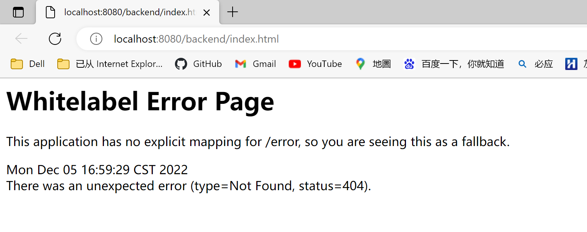

- 解决方案：maven中的plugin中进行clean一下，然后再run一次，即可
  - maven执行clean将target文件移除
  - 原因：修改的内容不生效，肯定是最终打出来的war包中的内容没有更新，而war包中会依赖其他子工程的jar包，如果jar 包没有更新过，那war包调用老的jar包也会导致新内容不生效。定位到问题的原因应该是jar包没有用最新的资源（java或者配置文件）
  - （看下maven官方文档的生命周期
- 效果：访问[瑞吉外卖管理端](http://localhost:8080//backend/page/login/login.html)
  - 

## 登录时报接口500异常（java.lang.NullPointerException: nulljava.lang.NullPointerException: null

- 函数传入参数位置需要加上@RequestBody

- ```java 
  public R<Employee> login(HttpServletRequest request,@RequestBody Employee employee) 
  ```

  - 原因：